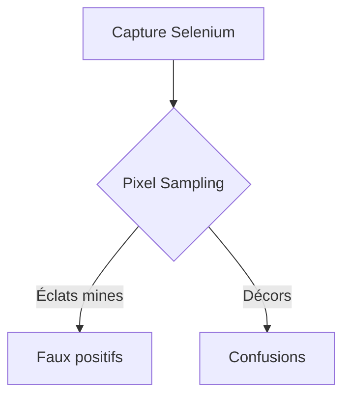
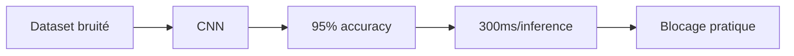
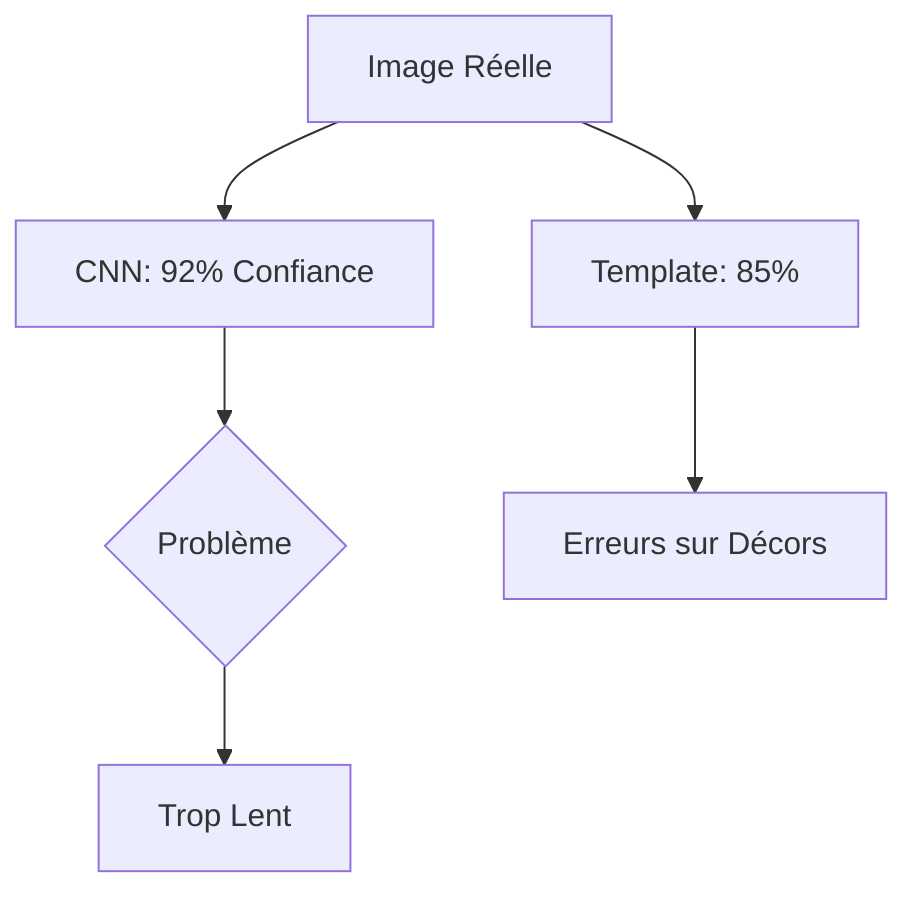
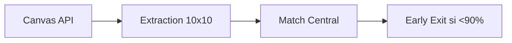

# Journal Vision - CNN (Nov-Dec 2025)

**25 novembre 2025**  
*Basculer sur le CNN*  
Implémentation du réseau décrit dans architecture_neurone.md :  
- Dataset généré via template matching  
- 95% de précision mais 300ms/case  
"Trop lent pour des grilles de 1000 cases"

## 1. Le Piège des Pixels (Nov 2025)

*"J'ai passé 3 semaines à tweaker les seuils... pour rien !"*
- Exemple typique :
  - Case réelle : 5
  - Reconnue comme : "3" (à cause d'un éclat)
  - Puis comme : "Décor" (faux positif)

## 2. L'Illusion CNN (Fin Nov 2025)

*"Le modèle avait tout compris... mais trop lentement !"*

## L'Épopée de la Reconnaissance Visuelle

### Le Cas Concret du Chiffre "5"

*"Cette case '5' était notre pire ennemi - reconnaissable mais trop lentement"*

### Percée Technique

*"En se concentrant sur le centre, on ignore les éclats perturbateurs"*