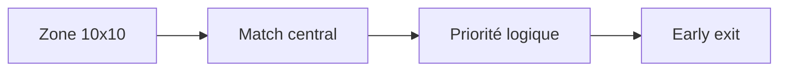

# Journal Architectural - Refonte Analytique (V2)

*Contient uniquement l'historique post-migration Python (novembre 2025+)*

---
**15 novembre 2025**  
*La grande migration JavaScript → Python*  
"Après 3 mois de lutte avec Selenium, le constat est clair..."  
- Nouvelle architecture modulaire  
- Adieu au code legacy

**28 novembre 2025**  
*Le tournant modulaire*  
Inspiré par les problèmes du solver :  
- Séparation stricte s0/s1/s2/s3/s4  
- Contrats clairs entre couches  

**5 décembre 2025**  
*Révolution canvas*  
"toDataURL() change tout !"  
- Extraction directe des pixels  
- 50x plus rapide que Selenium  
- Vue complète hors écran  

## Le Moment "Eurêka" avec Canvas
```mermaid
graph TB
    J[Canvas] --> K[toDataURL()]
    K --> L[Pixels bruts]
    L --> M[Template Matching]
    M --> N[0.1ms/analyse]
```

*"Enfin libéré de Selenium !"*  
- Comparaison avant/après :
  - Avant : 2s/screenshot + analyse
  - Après : 20ms total

## L'Élégante Simplicité


*"Moins de code, plus de résultats"*

**10 décembre 2025**  
*L'alignement final*  
Après 2 mois de refactoring :  
- Architecture validée par les benchmarks  
- Tous les modules respectent le contrat pipeline  

**10 décembre 2025**  
*Template Matching optimisé*  
Focus sur :  
- Zone centrale 10x10  
- Tolérance aux éclats configurable  
- Heuristiques de priorité