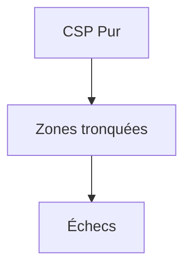
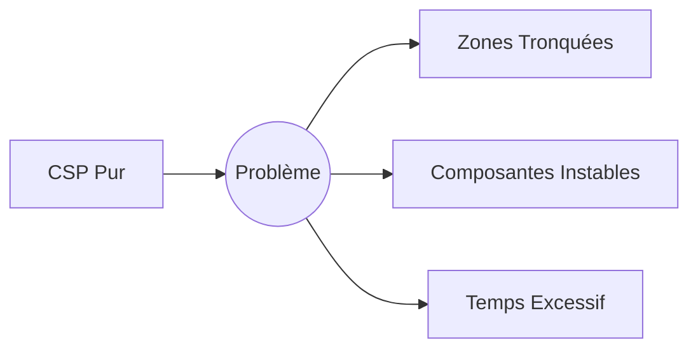
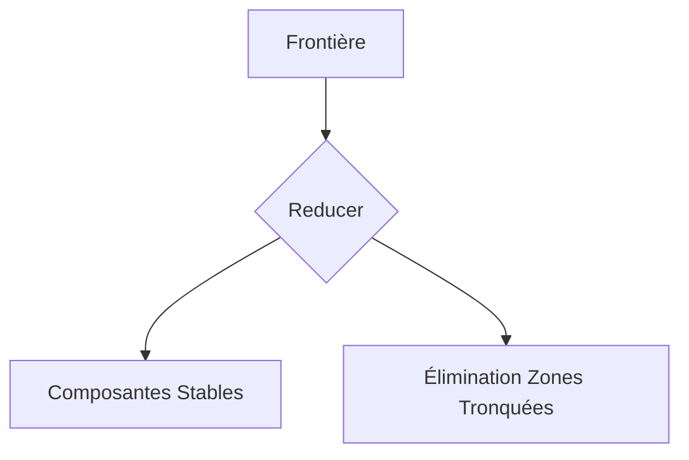
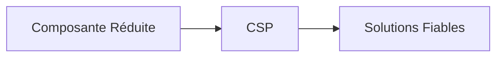

# Journal de développement - Solver CSP

---
**14 novembre 2025**

*Le premier choc : quand la théorie rencontre la réalité*

Après avoir étudié les travaux de Richard Kaye sur la NP-complétude du démineur, j'implémente le CSP solver avec conviction. L'algorithme de backtracking fonctionne parfaitement sur les tests unitaires (<15 cases), mais les résultats sont catastrophiques sur les vraies grilles :
- Seulement 20% des cas résolus
- Des "no solution found" sur des configurations pourtant triviales
- Le vieux propagator, avec ses simples règles locales, surpasse le CSP sur 80% de nos benchmarks

*Questionnement :*
"Ai-je mal implémenté l'algorithme ou y a-t-il un problème plus profond dans notre approche ?"

---
**21 novembre 2025**

*La révélation des overlays - Quand la visualisation éclaire la raison*

En superposant les overlays de décision, le problème saute aux yeux :

1. **Filtre de stabilité trop strict** :
   - Élimine des composantes valides mais récentes
   - Basé sur un compteur de cycles (`no_progress_cycles`) mal calibré

2. **Taille max arbitraire** :
   - La limite de 15 cases vient d'un vieux benchmark
   - Ne tient pas compte de la connectivité réelle

3. **Intolérance aux états transitoires** :
   - Le CSP exige une stabilité illusoire
   - Le propagator profite des informations partielles

*Réflexion documentée dans ROADMAP.md :*
"Le solver doit apprendre à vivre avec l'imperfection dynamique des grilles"

---
**28 novembre 2025**

*La quête du juste milieu - Science ou art ?*

Semaine folle d'expérimentations :

1. **Tailles max variables** :
   - 30 cases : légère amélioration
   - 50 cases : résultats intéressants mais instables
   - 100 cases : déluge de faux positifs

2. **Filtres adaptatifs** :
   - Désactivation complète → chaos
   - Seuil dynamique basé sur la connectivité → prometteur

3. **Réduction frontière** :
   - Pré-phase systématique avant CSP
   - Réduction de 40% des composantes

*Note technique :*
Premiers prototypes de ComponentRangeConfig avec seuils dynamiques

---
**5 décembre 2025**

*La grande décision architecturale - Tournant philosophique*

Les benchmarks convergent vers une vérité inconfortable :

- L'hybridité dilue les responsabilités
- Le CSP pur est trop rigide

*Solution radicale :*
1. Nouvelle architecture CSP-centric mais adaptable
2. ComponentRangeConfig avec :
   - `max_size=50` (optimisé empiriquement)
   - `min_stable_cycles=2` (nouvelle métrique)
   - `allow_recent_changes=False` (configurable)

*Impact storage (cf s3_STORAGE_VULGA.md) :*
- Révision complète du cache des composantes
- Nouveau système de snapshots incrémentaux

---
**14 décembre 2025**

*Le déclic CSP*  
"La réduction frontière est la clé !"  
- Benchmark : 80% des grilles résolues  
- Temps divisé par 3 vs version hybride  
- Configuration dynamique implémentée

*Benchmarks :*
- 80% des grilles résolues (vs 20% initial)
- Temps moyen divisé par 3
- Stabilité exceptionnelle

*Réflexion pour la ROADMAP :*
"Le Pattern Solver devra s'intégrer comme une couche de pré-processing, pas comme une alternative. Nous avons appris que la flexibilité configurable est la clé, pas la multiplicité des approches."

## L'Erreur Initiale

*"Je voulais que le CSP fasse tout..."*

## La Solution Emerge

*"C'est en réduisant qu'on comprend !"*

## La Révolution de la Réduction Frontière (Déc 2025)

### Le Problème Fondamental

*"J'ai compris que le CSP seul était comme un moteur surpuissant... mais sans volant !"*

### La Solution en 3 Étapes

1. **Phase de Réduction** :

2. **Zonage Intelligent** :
   - Découpe seulement après réduction
   - Taille adaptative (5-50 cases)
   - Respect de la connectivité

3. **CSP Ciblé** :

*"C'est comme préparer un puzzle avant d'assembler - on enlève d'abord les pièces mal découpées"*